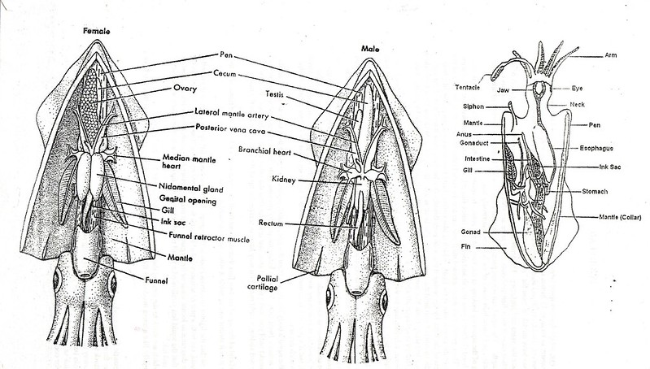

```{r global_options, include=FALSE}

knitr::opts_chunk$set(message=FALSE, tidy.opts=list(width.cutoff=60),tidy=TRUE) 

```


\  

### Sampling and data description

These data were originally collected as part of a study published in Aquatic Living Resources (Smith *et al*., 2005). The aim of the study was to investigate the seasonal patterns of investment in somatic and reproductive tissues in the long finned squid *Loligo forbesi* caught in Scottish waters. Squid were caught monthly from December 1989 - July 1991 (**month** and **year variables**). After capture, each squid was given a unique specimen code (**specimen variable**) and the following variables measured: 

\  

- **weight variable** - body weight (g)
- **sex variable** - sex (only female squid are included here)
- **DML variable** - individual dorsal mantle length (mm)
- **eviscerate.weight variable** - mantle weight measured without internal organs (g)
- **ovary.weight variable** - gonad weight (g)
- **nid.weight variable** - nidamental gland weight (g)
- **nid.length variable** - nidamental gland length (g)
- **dig.weight variable** -  digestive gland weight (g)

\  

Each individual was also assigned a categorical measure of maturity (**maturity.stage variable**) ranging from 1 to 5 with 1 = immature, 5 = mature.  

Some interesting background information on squid morphology can be found [here](https://en.wikipedia.org/wiki/Loligo_forbesii) and the following image provides a useful summary of squid anatomy.  

\pagebreak

{width=70%}

\  

### Data import and exploration

\  

```{r, data-import}
squid <- read.table('./data/squid1.txt', header = TRUE)
str(squid, vec.len = 2)
```

In this dataset `r nrow(squid)`  squid were caught and `r ncol(squid)` variables were measured for each squid. Details are shown above.

```{r, data-recode, echo=FALSE}
# convert variables to factors
squid$Fmaturity <- factor(squid$maturity.stage)
squid$Fmonth <- factor(squid$month) 
squid$Fyear <- factor(squid$year)
```

\  

The variables `maturity.stage`, `month` and `year` were converted from integers to factors in the dataframe  `squid`. These recoded variables were named `Fmaturity`, `Fmonth` and `Fyear`.  

\  

Next, let's take a look at the number of observations across years and months.

\  

```{r, data-obs}
library(knitr)
kable(table(squid$Fmonth, squid$Fyear), row.names = TRUE, format = 'markdown')
```

\  

In 1989 data were only collected during December and in 1991 data collection stopped in August. During 1990, no data were collected in either February or June. There are also some months that have very few observations (May 1990 and July 1991 for example) so care must be taken when modelling these data. 

\  

<!-- If you want a fancy table with the variable names (month and year) then use the pander function from the pander package. You will also have to provide the dimnames to the table and use the ftable function to 'flatten' the table. I have hidden this code and output in the final document but all you need to do is remove include=FALSE argument from the code chunk. -->

```{r, data-obs2, include=FALSE}
library(pander)
mytab <- table(squid$Fmonth, squid$Fyear)
names(dimnames(mytab)) <- c("Month", "Year")
pander(ftable(mytab))
```

\  

Number of observations in each month for each of the squid maturity stages are given in the table below.

\  

```{r, maturity-obs, echo=FALSE}
library(kableExtra)

kable(table(squid$Fmaturity, squid$Fmonth), row.names = TRUE, format = 'markdown')
```

\  

Not all maturity stages were observed in all months. Very few squid of maturity stage 1, 2 or 3 were caught in the months January to May whereas maturity stages 4 and 5 were predominantly caught during these months.

\  

Now let's check for any unusual observations in the variables; `DML`, `weight`, `nid.length` and `ovary.weight`. 

\  

```{r, dotplot}
par(mfrow = c(2, 2))
    dotchart(squid$DML, main = "DML")
    dotchart(squid$weight, main = "weight")
    dotchart(squid$nid.length, main = "nid length")
    dotchart(squid$ovary.weight, main = "ovary weight")
```

\  

It looks like the variable `nid.length` contains an **unusually large** value. Actually, this value is biologically implausible and clearly an error. I went back and checked my field notebook and sure enough it's a typo. I was knackered at the time and accidentally inserted a zero by mistake when transcribing these data. **Doh!** This squid was identified as `r which(squid$nid.length > 400)` with a sample number `r squid$sample.no[which(squid$nid.length > 400)]`. This observation was subsequently removed from the data set. 

\  

Let's take a look at whether DML changes with maturity stage.

\  

```{r, maturity-dml, echo=FALSE, fig.width=5, fig.height=4, fig.align='center'}

boxplot(DML ~ Fmaturity, data = squid, xlab = "maturity stage", ylab = "DML")

```

DML was lowest for maturity stage 1 with a mean length of `r round(mean(squid$DM[squid$Fmaturity == 1]), digits = 2)` mm. DML increased until maturity stage 3 (mean `r round(mean(squid$DM[squid$Fmaturity == 3]), digits = 2)` mm) after which it remained reasonably consistent for maturity stages 4 (mean `r round(mean(squid$DM[squid$Fmaturity == 4]), digits = 2)` mm) and 5 (mean `r round(mean(squid$DM[squid$Fmaturity == 5]), digits = 2)` mm). 

\  

### Session Information


```{r, session-info, eval=FALSE}
sessionInfo()
```

<!-- But i prefere to use the pander package as it wraps long lines nicely when rendering to PDF. I have hidden this code and output in the final document but all you need to do is remove echo=FALSE argument from the code chunk. -->


```{r, session-info2, echo = FALSE}
pander::pander(sessionInfo())
```
